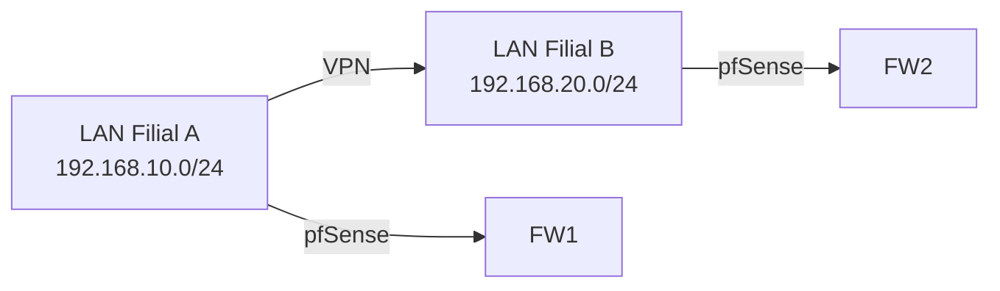

# 🧱 Infra Lab — Laboratório de Infraestrutura de TI

Bem-vindo ao **Infra Lab**, um portfólio técnico e prático de projetos em **infraestrutura, redes, servidores, automação e segurança**.

O objetivo é **construir e documentar ambientes reais**, aplicando **boas práticas, automação e regras de negócio** do mundo corporativo.

---

## 📂 Estrutura do projeto

```
infra-lab/
│
├── README.md
│
├── redes/
│   ├── README.md
│   ├── topologia-lan/
│   │   └── README.md
│   ├── vpn-site-to-site/
│   │   └── README.md
│   └── dns-dhcp-ad/
│       └── README.md
│
├── servidores/
│   ├── README.md
│   ├── linux-apache-nginx/
│   │   └── README.md
│   ├── windows-ad-file-server/
│   │   └── README.md
│   └── samba-integration/
│       └── README.md
│
├── virtualizacao/
│   ├── README.md
│   ├── vmware-lab/
│   │   └── README.md
│   ├── hyper-v/
│   │   └── README.md
│   └── docker-compose-labs/
│       └── README.md
│
├── automacao/
│   ├── README.md
│   ├── ansible-playbooks/
│   │   └── README.md
│   ├── terraform-labs/
│   │   └── README.md
│   └── scripts-powershell/
│       └── README.md
│
├── monitoramento/
│   ├── README.md
│   ├── zabbix-setup/
│   │   └── README.md
│   ├── grafana-dashboards/
│   │   └── README.md
│   └── promtail-loki/
│       └── README.md
│
└── seguranca/
    ├── README.md
    ├── hardening-windows-linux/
    │   └── README.md
    ├── backups-e-recovery/
    │   └── README.md
    └── analise-logs/
        └── README.md
```

---

## 🎯 Objetivos

- Consolidar fundamentos de infraestrutura (rede, SO, automação)
- Praticar **Infraestrutura como Código (IaC)**
- Criar **documentação técnica completa**
- Aplicar **regras de negócio reais**
- Manter um **portfólio profissional e versionado**

---

## 🧩 Ferramentas recomendadas

- **VirtualBox / VMware Workstation** — para criar os ambientes
- **VS Code + Git** — para versionar e editar
- **Docker Desktop / WSL2** — para simulações rápidas
- **Ansible / Terraform** — para automação e IaC
- **Draw.io / Mermaid** — para diagramas

---

## 🚀 Como usar

Cada pasta contém um **README.md** com:
- Descrição do laboratório
- Diagrama de rede
- Passos de instalação/configuração
- Regras de negócio
- Resultados esperados

---

## 🧱 Topologia



---

## ⚙️ Passos principais
1. Configurar IPs e rotas em cada lado.
2. Criar as regras de firewall no pfSense.
3. Configurar o túnel IPsec (fase 1 e 2).
4. Testar conectividade (ping, SSH, compartilhamentos).

---

## 📋 Regras de negócio
- Criptografia: AES-256
- Autenticação: Pre-shared key
- Disponibilidade: redundância de link simulada
- Retenção de logs: 30 dias

---

## 🧠 Conceitos aplicados
- VPN IPsec
- Tunelamento e encapsulamento
- Firewall rules
- Log e auditoria de tráfego

---

## ✅ Resultado esperado
- Comunicação entre hosts das duas LANs.
- Logs registrados de conexões.
- Gráfico de throughput no pfSense.

---

## 📎 Referências
- [Documentação pfSense VPN](https://docs.netgate.com/pfsense/en/latest/vpn/)
```

---

## 📘 Template genérico para qualquer subprojeto

```markdown
# 💡 Projeto: [Nome do Projeto]

## 🎯 Objetivo
Breve explicação do propósito e o que se deseja alcançar.

## 🔧 Tecnologias utilizadas
Liste sistemas operacionais, ferramentas, linguagens e protocolos.

## 🧱 Topologia / Arquitetura
(Use diagramas com Mermaid ou imagens do Draw.io)

## ⚙️ Passos de configuração
1. Passo 1
2. Passo 2
3. Passo 3

## 🧩 Regras de negócio
- Política de backup
- Disponibilidade mínima
- Controle de acesso
- Retenção de logs

## ✅ Resultado esperado
O que deve funcionar no final (prints, ping, dashboards etc.)

## 📎 Referências
Links úteis, documentação e tutoriais.
```
